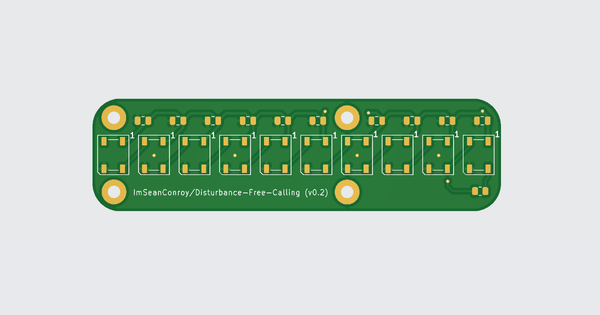
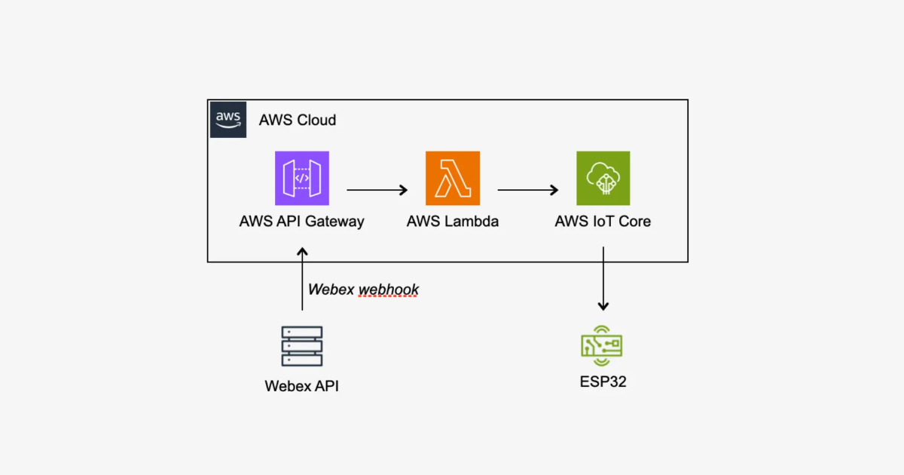

# Disturbance Free Calling

**Minimising disturbances to enable productive remote work** - In today's remote work environment, unintentional interruptions can disrupt productivity and communication. This project aims to solve that challenge by creating an IoT-powered availability indicator that minimizes disturbances during critical work activities such as calls and meetings.



This is **version 2.0**, building on the foundations of the [original version](https://www.linkedin.com/feed/update/urn:li:activity:6930081862153342977) developed in 2020. The initial solution utilized an **ESP32 microcontroller based development board** to poll the **Webex API** and display availability using an **LED strip**.While effective, it had room for improvement in **performance, reliability, and design** — which are now addressed in this upgraded version.

## Table of Contents

- [Monorepo Structure](#monorepo-structure)
- [Features and Development Roadmap](#features-and-development-roadmap)
    - [Current Features](#current-features)
    - [Upcoming Features](#upcoming-features)
- [Architecture Diagram](#architecture-diagram)
- [Getting Started](#getting-started)
    - [1. Clone the Repository](#1-clone-the-repository)
    - [2. Hardware Setup](#2-hardware-setup)
    - [3. AWS Infrastructure Setup](#3-aws-infrastructure-setup)
    - [4. Firmware \& Device Setup](#4-firmware--device-setup)
    - [5. Configure Webex Webhook](#5-configure-webex-webhook)
- [Hardware Requirements](#hardware-requirements)
- [Contributing](#contributing)
- [License](#license)
- [Support](#support)
- [Acknowledgments](#acknowledgments)

## Monorepo Structure

This project uses a monorepo that includes:

- **Hardware** – KiCad PCB files for custom boards
- **Firmware** – ESP32 firmware to drive the LED indicator
- **AWS Infrastructure** – Terraform setup for API Gateway, Lambda, and IoT Core
- **Backend** – Node.js Lambda functions to handle Webex webhook data

## Features and Development Roadmap

This project is a work in progress, the following outlines the current features and planned improvements:

### Current Features

- **Terraform Provisioning** - Automates the setup and deployment of necessary cloud infrastructure.
- **Webhook Integration** - Allows seamless communication between the IoT device and external services.

### Upcoming Features

- **Custom PCB** - Designed specifically to support the IoT-driven indicator system.
- **Custom ESP32 Integration** - Incorporate the newly developed custom ESP32 board into the system architecture.
- **Web UI dashboard** - A web interface that allows users to override availability status manually.

## Architecture Diagram

Below is a high-level overview of how the architecture operates:



**1. Webex Webhook → API Gateway** - A Webex webhook sends a request to an AWS API Gateway endpoint when a user’s availability status changes.

**2. Lambda Function → AWS IoT** - AWS API Gateway triggers an AWS Lambda function, which processes the Webex data and publishes the updated availability status to an AWS IoT Core MQTT topic.

**3. Device Subscribes → Updates LED** - The device subscribes to the AWS IoT topic and receives status updates, updatings the LED indicator accordingly.
 
> **Note**: A polling-based firmware version is available for setups that cannot use Webex webhooks. This version periodically queries the Webex API for status updates.

## Getting Started

Before getting started, ensure you have the following installed:

| Tool        | Purpose                           | Link                                                               |
| ----------- | --------------------------------- | ------------------------------------------------------------------ |
| Node.js     | Backend scripts & Lambda bundling | [Download](https://nodejs.org/)                                    |
| npm         | Node.js package manager           | [Download](https://www.npmjs.com/)                                 |
| Terraform   | Infrastructure provisioning       | [Install Guide](https://developer.hashicorp.com/terraform/install) |
| AWS CLI     | AWS access & configuration        | [AWS CLI](https://aws.amazon.com/cli/)                             |
| Arduino IDE | Firmware upload to ESP32          | [Arduino IDE](https://www.arduino.cc/en/software)                  |
| KiCad       | Open/edit PCB files               | [KiCad](https://www.kicad.org/)                                    |


### 1. Clone the Repository

First, clone the repository to access the firmware, backend, and PCB files:

```bash
git clone https://github.com/ImSeanConroy/disturbance-free-calling.git
cd disturbance-free-calling
```

### 2. Hardware Setup

1. **Open the Project** - Open the `PCB/disturbance-free-calling.kicad_pro` file in KiCad to view the project.
2. **Review the Design** - Inspect the schematic and PCB layout to ensure it meets your needs.
3. **Customize or Export** - Make any modifications and export the Gerber files for fabrication.
4. **Order the PCB** - Submit the Gerber files to your preferred PCB manufacturer (e.g. [JLCPCB](https://jlcpcb.com/capabilities/pcb-capabilities)).
5. **Get the Components** - Purchase the components from the BOM and a compatible board.
6. **Assemble the Hardware** - Solder the components and assemble the board.

### 3. AWS Infrastructure Setup

1. **Zip AWS Lambda Function.**
```bash
cd Backend && npm run install && npm run zip && cd ..
```

2. **Configure Terraform Environment Variables.**
```bash
export AWS_ACCESS_KEY_ID=<your-access-key>
export AWS_SECRET_ACCESS_KEY=<your-secret-key>
export AWS_REGION=<your-region>
```

3. **Deploy AWS Infrastructure**
```bash
terraform init
terraform apply
```

4. **Extract AWS IoT Credentials** - Save these values and add them to your firmware:
```bash
terraform output root_ca_url
terraform output device_certificate
terraform output device_private_key
```

### 4. Firmware & Device Setup

1. **Open Firmware Sketch** - Load Firmware/AwsIotController/AwsIotController.ino in the Arduino IDE.
2. **Configure Device Credentials** - Add Wi-Fi SSID/password and paste the AWS IoT credentials into the appropriate constants.
3. **Upload to Device Firmware** - Compile and upload the sketch to the ESP32 using Arduino IDE. Test connectivity.

### 5. Configure Webex Webhook

> TODO: Add step-by-step instructions for setting up the Webex webhook and linking it to the API Gateway endpoint.

## Hardware Requirements

The following are the required components to build the 2x6 LED Matrix:

| Quantity | Component | Description | Source |
| - | - | - | - |
| 10 | WS2812B-V5 | Individually addressable RGB SMD LEDs | [TME](https://www.tme.eu/gb/details/ws2812b-v5/smd-colour-leds/worldsemi/) |
| 1 | Seeed XIAO ESP32C3 | Microcontroller board | [PiHut](https://thepihut.com/products/seeed-xiao-esp32c3?variant=53975115661697) |
| 1 | USB-A to USB-C Cable | For power and programming | [PiHut](https://thepihut.com/products/usb-a-to-usb-c-cable-1m?variant=42520360779971) |

## Contributing

Contributions are welcome. Please open an issue or submit a pull request for any enhancements or bug fixes.

## License

This project is Distributed under the MIT License - see the [LICENSE](LICENSE) file for information.

## Support

If you are having problems, please let me know by [raising a new issue](https://github.com/ImSeanConroy/disturbance-free-calling/issues/new/choose).

## Acknowledgments

This project was made possible thanks to the following resources:

- [AWS re:Post](https://repost.aws/questions/QUxlg-arOrTcaxFAdNEj7hqA/lambda-publish-a-mqtt-message-to-iot-core-inside-a-lambda-function-with-node-and-sdk-3) - Publish a MQTT Message to IOT Core inside a Lambda function with Node and SDK 3
- [AWS Samples](https://github.com/aws-samples/aws-iot-esp32-arduino-examples) - Several Arduino examples for AWS IoT projects using ESP32.
